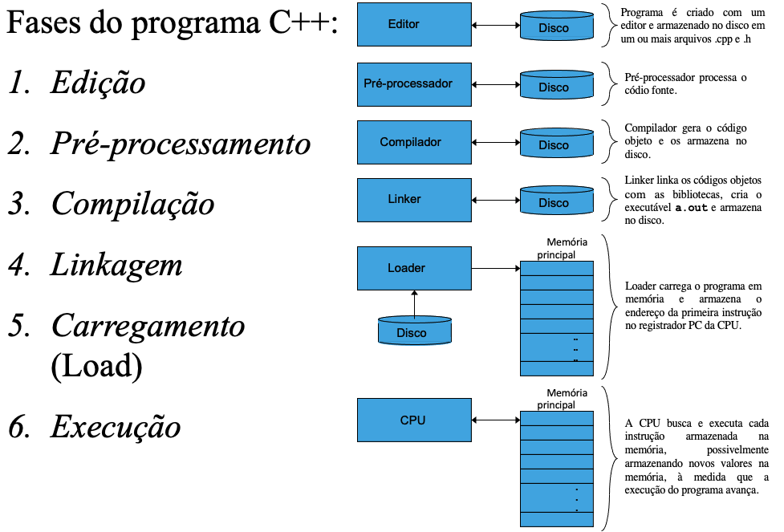

# INTRODUÇÃO AO C++

## ENTRADA E SAÍDA

cin -> associado a entrada padrão (teclado)

cout -> associado a saída padrão (monitor)

cerr -> saída de mensagens de erro

##

## NAMESPACE - (espaço de nomes)

std::

Específica o uso de um nome definido no namespace std

Pode ser removido se o comando using for definido

## OPERADOR DE INSERÇÃO DE STREAM <<

#### ex: std:cout << "hello"

passa o valor "hello" para o objeto associado a saída

## CARACTER DE SCAPE

Um Caracter precedido por \ - Indica um caracter especial

## COMANDO RETURN

Um dos caminhos para encerrar a execução do programa

Quando usando em main() o valor 0 indica que o programa terminou com sucesso

- return 0;

## FLOW DE EXECUÇÃO C++

## PROCESSO DE COMPILAÇÃO BÁSICA:

### `g++ nomeArquivo.cpp -o nomeArquivo.out`

### `./nomeArquivo.out`

Obs: Dependendo do compilador, ao invés de g++, utilize gcc no momento da compilação

## TIPOS PRIMITIVOS PRÉ DEFINIDOS, VARIÁVEIS E OPERADORES ARITMÉTICOS

Um tipo define a forma de armazenamento e conteúdo do dado. Traduzindo, em C++ você precisa especificar qual o tipo de dado que você esta trabalhando.

Uma variável é uma referência a uma instância de um dado tipo em memória.

#### Esses tipos podem ser:

primitivos: inteiros, caracteres...

abstratos: cout, cin... - objetos

### TIPOS DE DADOS PRIMITIVOS COMUNS:

int - números inteiros

char - caracteres

float - números em ponto flutuante de precisão simples

double - números em ponto flutuante de precisão dupla

bool - true or false ( 0 ou 1 )

### Variáveis são declaradas com um tipo e um nome

int var1;

int idade;

float nota1,nota2;

char meuNome;

#### Obs: Nomes de variáveis podem incluir letras, dígitos e underscores, mas NÃO podem começar com dígito e são case-sensitive.

### OPERADORES ARITMÉTICOS E ATRIBUIÇÕES:

#### + <- Operador de soma

#### - <- Operador de subtração

#### \* <- Operador de multiplicação

#### / <- Operador de divisão

      Divisão inteira trunca o resto
      7 / 2 é avaliado como 3
      7.0 / 2.0 é avaliado como 3.5

#### % <- Operator de módulo returna o resto da divisão

      7 % 5 é avaliado como 2

#### = <- operador de atribuição

#### Agrupamento de subexpressões

Em C++ usamos parênteses para agrupar subexpressõe, da mesma forma que fazemos com expressões algébricas

#### Regras de Procedência:

Operadores entre parênteses são avaliados primeiro, dos mais internos para os mais externos

Em seguida, multiplicação, divisão e módulo
Num mesmo nível, avaliados da esquerda para direita

Por fim, adição e subtração
Num mesmo nível, avaliados da esquerda para a direita

#### Obs: Algumas linguagens de programação possuem os operadores \*\* ou ^ para representar exponenciação. C++ não suporta esses operadores.
