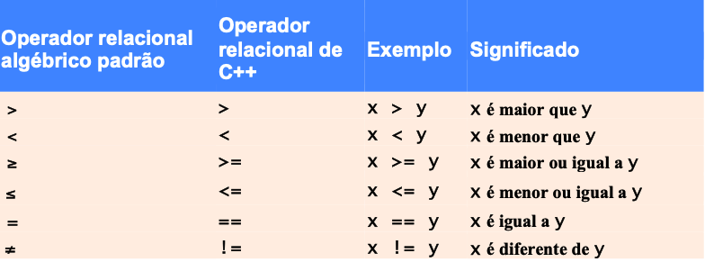
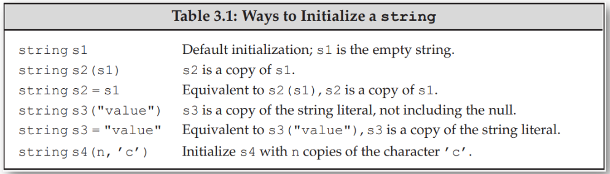
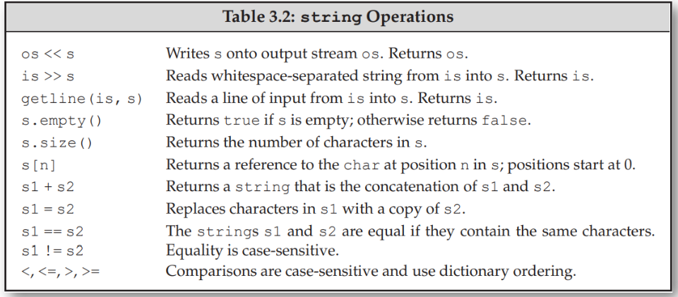
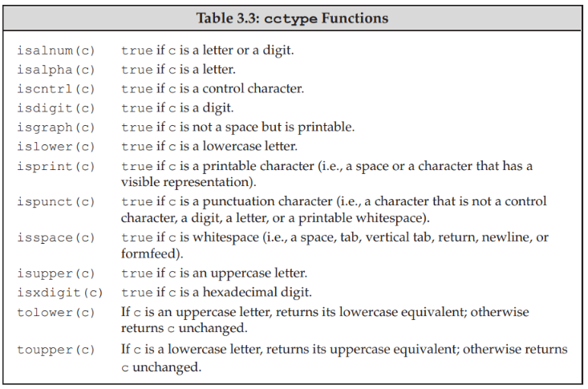
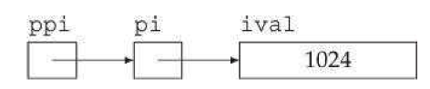

# INTRODUÇÃO AO C++

## ENTRADA E SAÍDA

cin -> associado a entrada padrão (teclado)

cout -> associado a saída padrão (monitor)

cerr -> saída de mensagens de erro

##

## NAMESPACE - (espaço de nomes)

std::

Específica o uso de um nome definido no namespace std

Pode ser removido se o comando using for definido

## OPERADOR DE INSERÇÃO DE STREAM <<

#### ex: std:cout << "hello"

passa o valor "hello" para o objeto associado a saída

## CARACTER DE SCAPE

Um Caracter precedido por \ - Indica um caracter especial

## COMANDO RETURN

Um dos caminhos para encerrar a execução do programa

Quando usando em main() o valor 0 indica que o programa terminou com sucesso

- return 0;

## FLOW DE EXECUÇÃO C++

## PROCESSO DE COMPILAÇÃO BÁSICA:

### `g++ nomeArquivo.cpp -o nomeArquivo.out`

### `./nomeArquivo.out`

Obs: Dependendo do compilador, ao invés de g++, utilize gcc no momento da compilação

## TIPOS PRIMITIVOS PRÉ DEFINIDOS, VARIÁVEIS E OPERADORES ARITMÉTICOS

Um tipo define a forma de armazenamento e conteúdo do dado. Traduzindo, em C++ você precisa especificar qual o tipo de dado que você esta trabalhando.

Uma variável é uma referência a uma instância de um dado tipo em memória.

#### Esses tipos podem ser:

primitivos: inteiros, caracteres...

abstratos: cout, cin... - objetos

### TIPOS DE DADOS PRIMITIVOS COMUNS:

int - números inteiros

char - caracteres

float - números em ponto flutuante de precisão simples

double - números em ponto flutuante de precisão dupla

bool - true or false ( 0 ou 1 )

### Variáveis são declaradas com um tipo e um nome

int var1;

int idade;

float nota1,nota2;

char meuNome;

#### Obs: Nomes de variáveis podem incluir letras, dígitos e underscores, mas NÃO podem começar com dígito e são case-sensitive.

### OPERADORES ARITMÉTICOS E ATRIBUIÇÕES:

#### + <- Operador de soma

#### - <- Operador de subtração

#### \* <- Operador de multiplicação

#### / <- Operador de divisão

      Divisão inteira trunca o resto
      7 / 2 é avaliado como 3
      7.0 / 2.0 é avaliado como 3.5

#### % <- Operator de módulo returna o resto da divisão

      7 % 5 é avaliado como 2

#### = <- operador de atribuição

#### Agrupamento de subexpressões

Em C++ usamos parênteses para agrupar subexpressõe, da mesma forma que fazemos com expressões algébricas

#### Regras de Procedência:

Operadores entre parênteses são avaliados primeiro, dos mais internos para os mais externos

Em seguida, multiplicação, divisão e módulo
Num mesmo nível, avaliados da esquerda para direita

Por fim, adição e subtração
Num mesmo nível, avaliados da esquerda para a direita

#### Obs: Algumas linguagens de programação possuem os operadores \*\* ou ^ para representar exponenciação. C++ não suporta esses operadores.

### Fluxo de Controle - Operadores relacionais, comandos de decisão e de repetição

Os operadores relacionais sempre retornam um boolean verdadeiro (true) ou falso (false)

#### Comando IF:

- Se condição é true, corpo do if é executado
- Se condição é false, corpo do if não é executado

#### Comando IF ELSE:

- Se condição é true, corpo do if é executado
- Se condição é false, corpo do else é executado
#### Comando While:
- O comando while executa repetidamente os comandos definidos em ser corpo enquanto a condição for avaliada como verdadeira.
  
Eventualmente é necessário solicitar ao usuário que entre com dados, mas não é possível saber, a priori, a quantidade de valores que serão fornecidos.

É possível resolver isso aliando o comando while com o comando cin. Exemplo:

      While(std::cin >> valor){

      }

std::cin >> valor lê a próxima entrada  para a variável valor e retorna o operando da esquerda (std::cin)

#### Comando For:

O comando for executa repetidamente os comandos definidos em seu corpo enquanto a condição for avaliada como verdadeira. É usado principalmente quando sabemos de antemão quantas repetições serão necessárias

### Strings

As cadeias de caracteres são gerenciadas pela classe string, acessível pela biblioteca < string >
      
      #include <string>
      using std:string;

### Strings - Leitura e Escrita

Utiliza os mesmos operadores de entrada e saída < iostream >

### Strings - Operadores

### Strings - Leitura e Escrita de linhas 

Para leitura de strings separadas por espaço, descartando \n

      int main()
      {
            string line;
            //read input a line at a time until end-of-file;
            while(getline(cin,line))
                  cout << line << endl;
            return 0;
      }

### Strings - Acessando Caracteres

      string str('some string')
      for (auto c : str)
            cout << c << endl;

### Strings - Funções para caracteres

### Referências:
São tipos de dados que são definitos a partir de outros tipos.

  - Define um nome alternativo para uma variável;
  - Uma referência é definida associando um & ao nome de uma variável;

Exemplo: 

      int ival = 1024;

      int &refVal = ival; 

      refVal = 2; // ou seja, ival=2

      int umInt = refVal; // umInt = ival;

      int &refVal12; //erro, Toda referência deve ser inicializada;

### Structs:

      struct Sales_data {
            std::string bookNo;
            unsigned units_sold = 0;
            double revenue = 0.0; 
      };

      int main(){
            Sales_data data1, data2;
            
            std::cin > data1.bookNo >> data1.units_sold >> price;

            data1.revenue = data1.units_sold * price;
      }

### Ponteiros:

São tipos de dados, usados para "apontar" para outras variáveis;

- Entenda apontar como guardar o endereço em memória de outras variáveis;
- Ponteiros, assim como referências, são utilizados para acesso indireto ao conteúdo das variáveis;
  - Diferente de referências, ponteiros não precisam ser inicializados no momento de sua criação;
- São mais poderosos que referências, pois não são apenas um novo nome para uma variável;
- Ponteiros são declarados usando * junto ao nome da variável.

Exemplo: 
      
      double dval;
      
      double *pd = &dval; //pd guarda o endereço de dval
      
      double *pd2 = pd; // tanto pd quanto pd2 apontam para dval;
      
      int *pi = pd; // erro: tipos de pi ue pd são diferentes;

      int *pi2 = &dval; // erro: endereço de double atribuido ao ponteiro int

Um ponteiro pode estar nas seguintes situações:
   
   1. Apontando para uma variável de tipo correspondente;
   2. Apontando para a posição em memoria imediatamente após uma variável;
   3. Pode ser um ponteiro Null, indicando que não esta apontando para nenhuma variável;
   4. Pode ser um ponteiro inválido;

Para acessar o conteúdo apontado por um ponteiro usamos o operador de derreferenciação (*)

      int ival = 42;
      
      int *p = &ival; // p tem o endereço de ival

      cout << *p; //imprime 42

      int *p1 = nullptr;

      int *p2 = null; 

### Ponteiros de Ponteiros

Em geral, não há limites para o nível de indireção aplicada a ponteiros

      int ival = 1024;
      int *pi = &ival;
      int **ppi = &pi;

### Referências para ponteiros

É possível também criar referências para ponteiros. Tal como para outras variáveis, a referência passa a ser um outro nome para o ponteiro.

      inti = 42;
      
      int *p;
      
      int *&r = p; //r é uma referência para o ponteiro p

      r = &i; //equivalente a fazer p apontar para i

      *r = 10; //equivalent a derreferenciar p, logo atribui 10 a variavel i

### Mais sobre ponteiros:

### Qualificador const

Tornar o valor de uma variável imutável, isto é, constante.
Quando este qualificador é usado a variável deve ser iniciada obrigatoriamente

      const int i = get_size(); //inicializada em runtime
      const int j = 42; //inicializada em compilacao
      const int k; //erro, sem inicialização

O qualificador const, quando usado com ponte4iros leva a três possíveis situações.

1. Ponteiro não constante apontando para variável constante;
2. Ponteiro constante apontando para variável constante;
3. Ponteiro constante apontando para variável não constante;

### Type Aliases (apelidos para tipos)

Define um nome que serve como sinônimo para um tipo. Duas possibilidaes

- Com typedef:
  
      typedef double wages; //wages se torna sinonimo de double

- Com using:

      using wages = double;

### Funções - passagem de parâmetros:

Cada vez que uma função é invocada, seus parâmetros são criados e inicializados pelos argumentos passados na chamada

  - Quando um parâmetro é uma referência, dizemos que o argumento é passado por referência;
  - Quando o valor do argumento é copiado, parâmetro e argumento são objetos independentes, configurando umas passagem por valor.

### Funções - passagem por valor:

      int fact(int val){
            int ret = 1;
            while(val > 1)
                  return *= val--;
            return ret;
      }

      int main(){
            int j = fact(5);
            cout << "5! is = " << j << endl;

            return 0;
      }

### Funções - ponteiros como parâmetro:

  - Ponteiros se comportam como qualquer tipo não-referenciável
  - Entretanto, um ponteiro também dará acesso indireto ao objeto apontado;

			void reset(int *ip){
				*ip = 0;
				ip = 0;
			}

			int i = 42;
			reset(&i);

			cout << "i = " << i << endl;
            
### Funções - ponteiros como referência:

		void reset(int &i){
			i = 0;
		}

		int j = 42;
		reset(j)

		cout << "j = " << j << endl;

### Funções - passagem por referência:

  Utilidades:
  - Evitar cópia de dados potencialmente grandes;
  - "Retornar" mais de um parâmetro

		string::size_type find_char(const string &s, char c, string::size_type &occurs){
			auto ret = s.size();
			occurs = 0;

			for(decltype(ret) i = 0; i != s.size(); i++){
				if(s[i] == c){
					if(ret == s.size())
						ret = i;
					++occurs;	
				}
			}
			return ret;
		}

### Alocação Dinâmica de Memória em C++ :

- A memória é divida em duas partes em C++

- Stack (Pilha) : Todas as variáveis declaradas dentro do escopo da função irão ocupar espaço na pilha;
- Heap: Parte de memória não utilizada pelo programa e que poderá ser utilizada para alocar memória dinamicamente enquanto o programa é executado.

- Por que é tão util ? 
  - Muitas vezes não sabemos quanto de memória nosso programa precisara utilizar, dessa forma podemos fazer com que a memória seja inserida dinamicamente conforme a necessidade.

- Podemos alocar a memória em tempo de execução no heap para a variável usando um operador especial em C++ que retorna o endereço do espaço alocado. Esse operador é chamado de *new*

- Caso não necessite mais da memória basta utilizar o operador *delete*, desalocando a memória anteriormente alocada com o operador *new*.

- Sintaxe Geral para alocação: 

      new data-type;
      double* pvalue = NULL; // ponteiro inicializado com valor nulo
      pvalue = new double; // solicita alocação de memória para a variável;

- Como checar se a memória foi alocada corretamente: 
  
      double* pvalue = NULL;
      if(!(pvalue = new double)){
            cout << "Error: out of memory." << endl;
            exit(1);
      }

OBS: A função *malloc()* do C ainda existe em C++. Porém é recomendado evita-lá. A principal vantagem do *new* em relaçãoao *malloc()* é que o *new* não apenas aloca memória, mas constrói objetos, o que é o próposito principal do C++;

- Para deletar a memória, em caso de não precisar mais dela alocada, basta usar o delete;

      delete pvalue; // libera o espaço de memória apontado para pvalue;

Exemplo completo: 

      #include <iostream>
      using namespace std;

      int main(){
            double* pvalue = NULL;
            pvalue = new double;

            *pvalue = 29494.99;
            cout << "Value of pvalue: " << pvalue << endl;

            delete pvalue;

            return 0;
      }

- Alocando dinamicamente em Arrays: 

      char* pvalue = NULL;
      pvalue = new char[20];

      delete [] pvalue;

- Alocando dinamicamente para objetos:

      #include <iostream>
      using namespace std;

      class Box{
            public:
                  Box(){
                        cout << "Constructor called! " << endl;
                  }     
                  ~Box(){
                        cout << "Destructor Called !" << endl;
                  }
      };

      int main(){
            Box* myBoxArray = new Box[4];
            delete [] myBoxArray;

            return 0;
      }