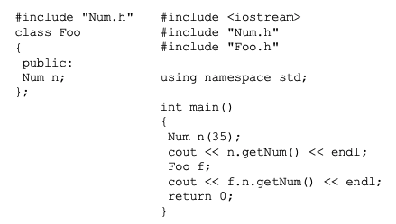
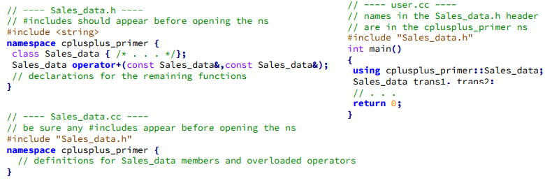

# INTRODUÇÃO A PROGRAMAÇÃO ORIENTADA A OBJETOS: 

## Surgimento: 

 - Crise do Software
   - Dificuldade de escrever programas eficientes e úteis;
   - Capacidade do hardware expandiu rapidamente;
   - Métodos existentes eram inadequados;


 - Principais Problemas
   - Reusabilidade e extensibilidade de módulos;
   - Representar entidades do mundo real;
   - Projetar sistemas com interfaces abertas;
   - Aumentar produtividade e diminuir custo;
   - Gerenciar tempo de entrega;

 - POO
   - Existe como coneito desde os anos 1950;
   - Primeira aparição em uma linguagem no final dos anos 1960 (Simula);
   - Popularização a partir dos anos 1990;
## Genealogia das Linguagens: 


## Hierarquia de Paradigmas: 


#### IMPERATIVO: 

 - Programas centrados no conceito de estado (variáveis) e ações (comandos)
 - Computação como um processo que realiza mudanças de estados
 - Especificam como um computador deve realizar uma tarefa;

#### DECLARATIVO: 

 - Descrevem relação explícita e precisa entre as entradas e saídas
 - Variáveis são incógnitas e não representam células de memória
 - Especificam o que são as tarefas (Ex: LISP,Prolog, SQL)

#### ESTRUTURADO: 

 - Também conhecido como estrutural
 - Separação clara entre dados e funções
 - Modelo centrado nas funções

Prós: 
  - Mais Eficiente
  - Útil para programas pequenos e algoritmos individuais

Contras: 
  - Não escalável
  - Inadequado para sistemas complexos/grandes

##
### Visão Geral sobre POO: 

- Ideías Chave:
  - Abstração de dados
    - Separação entre interface e implementação;
  - Herança
    - Modelagem de relacionamentos entre tipos similares
  - Vinculação Dinâmica
    - Uso de objetos similares, ignorando detalhes que os diferem

- Programas são estruturados em Módulos (classes) que agrupam um estado e operações
- Classes são usadas como tipos, cujas instâncias são objetos
- Programador usa abstrações mais próximas do mundo real
- Facilidade de reutilização do código
- Separação entre interface e implementação

##
### Abstração em POO: 

- Necessária para se concentrar apenas nos aspectos relevantes para o problema
- Define limites para o tamanho da classe
- Permite que a especificação possa ser gradativa
- Reduz complexidade de programação e utilização


##
### Objetos: 

- Objetos possuem estrutura (dados) e comportamento (funções)
- A estrutura de um objeto é representada em termos de atributos
- O comportamento de um objeto é representado pelo conjunto de operações que podem ser executadas a partir dele

#### Exemplos: 


##


##
### Classes: 

- Objetos com a mesma estrutura e o mesmo comportamento são agrupados em classes


- Classes descrevem um conjunto de objetos do mesmo tipo
- Cada objeto é dito ser uma instância de uma classe
- Cada instância de uma classe tem seus próprios valores para cada atributo
- Compartilham o mesmo comportamento com outras instâncias

##


##

### Atributos:

- Características específicas dos objetos
- Cada atributo tem um valor para um objeto particular
- Para cada atributo deve ser definido o nome do atributo e o tipo do valor que pode ser armazenado


##

### Metódos:

- Funções que podem ser aplicadas em/por um objeto de uma classe
- Conjunto de métodos forma o comportamento
- Objetos de mesma classe compartilham mesmos métodos
- Assim como funções, podem ter parâmetros

##

### Classes e Objetos em UML: 


##

### Mensagem: 

- Quando objeto A quer que o objeto B realize uma ação, uma mensagem de A para B é enviada
- Invocação é um método
- Deve conter:
  - O objeto alvo
  - O método a ser execudado
  - Parâmetros do método, se necessário


##

### Definição de Classes em C++


- Variáveis de instância:
  - Conjunto de identificadores que guardam os valores dos atributos em um determinado objeto

Exemplo:


- Métodos:
  - Declaração na forma de uma função
  - Parâmetros são passados quando o método é invocado


### Interface Pública VS Implementação

- A interface pública de um objeto contém os membros visíveis a outros objetos
  - Declarados com o modificador de acesso *public*
- A implementação de um objeto contém os membros privados do objeto
  - Vísiveis apenas dentro dos objetos onde eles foram declarados
  - Declarados com o modificador de acesso *private*
- A distinção entre interface pública e implementação é chamade de *encapsulamento*

### Encapsulamento

  - Separa os aspectos externos de um objeto dos detalhes internos de implementação do objeto
  - Evita que pequenas mudanças possam ter grandes efeitos colaterais
  - Permite que a implementação possa ser modificada sem afetar as aplicações que usam o objeto


Em geral, métodos de uma classe são dos seguintes tiposÇ
  - Seletores (get)
  - Modificadores (set)
  - Construtores 

### Construtores

  - Evocados quando se pretende criar uma nova instância da classe
  - Possuem declaração especial:
    - Mesmo nome da classe
    - Não fazem menção a valores de retorno
  - Podem exigir parâmetros, usados para inicialização
  - Classes Podem possuir mais de um construtor


### Seletores

  - Permitem obter os valores guardados nas variáveis de instância
  - Geralmente possuem argumento vazio e limitam-se a devolver o valor de um atributo
  - Habitualmente designados pela palavra get seguida pelo nome do atributo
  


### Modificadores 

  - Permitem alterar os valores das variáveis de instância
  - Geralmente têm como argumento o novo valor a atribuir
  - Não devolvem qualuer valor
  - Habitualmente designados pela palavra set seguido pelo nome do atributo


 

 ### Destruidores

  - Função membro de uma classe delete um objeto
  - Automaticamente invocados quando um objeto é destruido
    - Quando o escopo de utilização é encerrado
  - Não possui argumentos nem retorno, nem mesmo void
  - Definidos por padrão nas classes quando não declarados
  - Necessário quando a classe manipula dinamicamente a memória
  
  


 ### Herança
  - Permite criar novas classes a partir de classes existentes
  - A classe que herda (subclasse) reutiliza os atributos e métodos da classe herdada (superclasse)
  - A subclasse (classe derivada) pode adicionar novos atributos ou métodos, além de sobrescrever métodos da superclasse (classe base)
  


 ### FUNÇÃO AMIGA

 Definição: 

   - Função definida fora de uma classe, mas que possui acesso aos membros privados e protegidos dela 
   - Acessa a implementação como um membro da classe, sem o ser
   - Mesmo definida fora, deve ter seu protótipo declarado internamente á classe

Princpais utilidades:

  - Casos especiais onde membros privados da classe precisam ser acessados sem o uso de objetos desta;
  - Sobrecarga de operadores

Outros exemplos de uso: 

  - Definição de um operador/função que multiplica uma matriz por um vetor, onde ambos são classes diferentes;
  - Cada um possui sua respectiva representação e provê um conjunto de operações para manipular objetos do mesmo tipo
  - A rotina de multiplicação, se inserida como membro das classes, exigiria a implementação em ambas e acesso aos dados privados
    - Também exigiria a invocação a partir de objetos de uma das duas classes
  - O acesso a atributos de classes não é recomendado ser público
  - Solução: Declarar uma função de multiplicação como *amiga* de ambas

### SEPARANDO DEFINIÇÃO DE IMPLEMENTAÇÃO

A definição de classes em C++ é comumente divídida em dois arquivos separados (e ambos fora do arquivo de utilização destas):

  - A descrição da classe, com seus atributos e protótipos dos métodos costuma vir num arquivo .h 
  - A implementação dos métodos vem num arquivo .cpp com o nome da classes

Benefícios:

  - Se a implementação da classe não mudar, não precisa ser recompilada
  - Separação entre implementação e utilização explicita
  - Organização do código

### Uso do #ifndef

  - Algumas vezes podemos incluir um arquivo de cabeçalho múltiplas vezes
  - O compilador pode entender como se estivéssemos tentando redefinir alguma coisa novamente
  - Solução: Informar ao compilador (diretiva) que a biblioteca Num não deve ser redefinida se ja o foi



### SEPARANDO DE FATO

Compile cada arquivo .cpp num arquivo object (.o) que contém o código de máquina para aquele arquivo:
  - g++ -c main.cpp Num.cpp

Realize o link entre os arquivos e o executável:
  - g++ main.o Num.o

Se apenas o executável mudar, compile apenas ele:
  - g++ -c main.cpp 

Depois, linke-os novamente:
  - g++ main.o Num.o

### CRIANDO O ARQUIVO MAKE:

Arquivo que define as dependências do programa e o que precisa ser compilado
  - Processo automatizado por IDES

  - Quando invocado, compila apenas o que foi modificado 
  - Permite a limpeza dos arquivos de saída para recompilação


### NAMESPACES:

Poluição do espaço de nomes:

  - Programas grandes tendem a utilizar bibliotecas independentes
  - Bibliotecas independentes tendem a definir grande quantidade de nomes globais, classes, funções e etc.
  - Situação em que se torna comum a colisão entre nomes, devido á poluição do espaço de nomes;


Solução Ultrapassada:

  - Programadores evitavam tal poluição utilizando nomes muito grandes para entidades globais
  - Os nomes continham prefixo indicando qual biblioteca havia definido o nome:
  
```cpp
  class cplusplus_primer_Query { ... };
  string cplusplus_primer_make_plural(size_t, string&);
```

### NAMESPACES:

  - A definição de espaços de nomes provê um mecanismo muito mais controlável para a prevenção de colisões
  - Particiona o espaço de nomes global, criando um escopo
  - A definição de bibliotecas dentro de um espaço reservado permite que programadores possam definir nomes independentes do escopo global;
  

### NAMESPACE - DEFINIÇÃO:

  - Começa com a palavra chave *namespace* seguida da definição do nome
  - Na sequência, vem as declarações e definições delimitadas entre chaves;

```cpp
  namespace cplusplus_primer {
    class Sales_data { /* .... */};
    Sales_data operator+(const Sales_data&, const Sales_data&);
    class Query { /* ... */};
    class Query_base { /* ... */};
  } // like blocks, namespaces do not end with a semicolon;
```

### NAMESPACE - ESCOPO:

  - Cada novo namespace introduz um escopo diferente, podendo então ter membros com o mesmo nome;
  - Podem ser acessados diretamente por outros membros de outros espaços de nome;
  - Podem ser descontínuos

```cpp
  cplusplus_primer::Query q = cplusplus_primer::Query("hello");
  AddisonWesley::Query q = AddisonWesley::Query("hello");
```

#### Separação Interface/Implementação:

  - Atua junto da estratégia de separação de interface e implementação em arquivos separados



### NAMESPACE - DEFINIÇÃO DE MEMBROS:

  - Códigos internos a um espaço de nomes podem usar a forma curta dos nomes

```cpp
  namespace cplusplus_primer {
    //reopen cplusplus_prinmer
    //members defined inside the namespace may use unqualified names
    std::istrem&
    operator >> (std::istream& in, Sales_data& s) { /* ... */}
  }
```

  - Também é possível definir um membro de um ns fora dele:

```cpp
  // namespace members defined outside the namespace must use qualified names
  cplusplus_primer::Sales_data
  cplusplus_primer::operator+(const Sales_data&, lhs,
  const Sales_data& rhs) 
  {
    Sales_Data ret(lhs);
    // ...
  }
```

### NAMESPACE - Global e aninhamento:

  - Implicitamente declarado, pode ser referenciado pelo operador de escopo (sem nome) -> ::member_name
  - Podem ser aninhados:

```cpp
  namespace cplusplus_primer {
    //first nested namespace: defines the Query portion of the library
    namespace QueryLib {
      class Query { /* ... */};
      Query operator&(const Query&, const Query&);
      // ...
    }
    // second nested namespace: defines the Sales_data portion of the library
    namespace Bookstore {
      class Quote { /* ... */};
      class Disc_quote : public Quote { /* ... */};
      // . . . 
    }
  }

  cplusplus_primer::QueryLib::Query
```

### NAMESPACE - ALIASES:

  - Permite associar um sinônimo mais curto a um ns definido


```cpp
  namespace cplusplus_primer { /* ... */};

  namespace primer = cplusplus_primer;

  namespace Qlib = cplusplus_primer::QueryLib;
  Qlib::Query q;
```

#### A DECLARAÇÃO USING:

  - Permite apresentar a utilização de um namespace por vez
  - Nomes introduzidos pela declaração obedecem regras normais de escopo:
    - São visíveis desde a declaração até o final do escopo onde a declaração aparece
    - Entidades com o mesmo nome definido em um escopo externo são escondidas
    - Nomes não qualificados podem ser usados somente dentro do escopo onde houve a declaração
    - Encerrando o escopo, nomes qualificados devem ser utilizados

```cpp
  #include <iostream>
  #include <string>

  using std::string;

  int main() {
    string str = 'Example';
    using std::cout;
    cout << str;
  }
```

### A DIRETIVA USING:

  - Diferente da declaração, permite usar a forma não qualificada de todos os nomes definidos em um namespace
  - Seu uso indiscriminado reintroduz os problemas de colisão inerentes a utilização de múltiplas bibliotecas

### A DIRETIVA USING - ESCOPO:

  - Torna o espaço de nomes disponível desde o escopo global do programa

```cpp
  // namespace A and function f are defined at global scope
  namespace A {
    int i, j;
  }
  
  void f() {
    using namespace A;

    // injects the names from A into the global scope

    cout << i * j << endl; //uses i and j from namespace A
    // ...
  }
```

### A DIRETIVA USING - PRECAUÇÕES:

  - Reintroduz riscos a colisão de nomes em programas grandes;
  - Torna programas vulneráveis a atualização de biblitoecas que venham a declarar nomes conflitantes;
  - Erros de longo prazo podem aparecer á medida que a biblitoeca for sendo mais explorada
  - Uso da declaração é mais indicado, pois oferece maior controle sobre erros;
  - Diretivas são mais úteis nos arquivos de implementação do próprio contexto do namespace;
