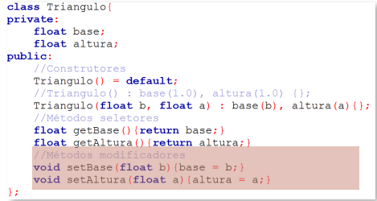

# INTRODUÇÃO A PROGRAMAÇÃO ORIENTADA A OBJETOS: 

## Surgimento: 

 - Crise do Software
   - Dificuldade de escrever programas eficientes e úteis;
   - Capacidade do hardware expandiu rapidamente;
   - Métodos existentes eram inadequados;

 - Principais Problemas
   - Reusabilidade e extensibilidade de módulos;
   - Representar entidades do mundo real;
   - Projetar sistemas com interfaces abertas;
   - Aumentar produtividade e diminuir custo;
   - Gerenciar tempo de entrega;

 - POO
   - Existe como coneito desde os anos 1950;
   - Primeira aparição em uma linguagem no final dos anos 1960 (Simula);
   - Popularização a partir dos anos 1990;
## Genealogia das Linguagens: 

## Hierarquia de Paradigmas: 

#### IMPERATIVO: 

 - Programas centrados no conceito de estado (variáveis) e ações (comandos)
 - Computação como um processo que realiza mudanças de estados
 - Especificam como um computador deve realizar uma tarefa;

#### DECLARATIVO: 

 - Descrevem relação explícita e precisa entre as entradas e saídas
 - Variáveis são incógnitas e não representam células de memória
 - Especificam o que são as tarefas (Ex: LISP,Prolog, SQL)

#### ESTRUTURADO: 

 - Também conhecido como estrutural
 - Separação clara entre dados e funções
 - Modelo centrado nas funções

Prós: 
  - Mais Eficiente
  - Útil para programas pequenos e algoritmos individuais

Contras: 
  - Não escalável
  - Inadequado para sistemas complexos/grandes

##
### Visão Geral sobre POO: 

- Ideías Chave:
  - Abstração de dados
    - Separação entre interface e implementação;
  - Herança
    - Modelagem de relacionamentos entre tipos similares
  - Vinculação Dinâmica
    - Uso de objetos similares, ignorando detalhes que os diferem

- Programas são estruturados em Módulos (classes) que agrupam um estado e operações
- Classes são usadas como tipos, cujas instâncias são objetos
- Programador usa abstrações mais próximas do mundo real
- Facilidade de reutilização do código
- Separação entre interface e implementação

##
### Abstração em POO: 

- Necessária para se concentrar apenas nos aspectos relevantes para o problema
- Define limites para o tamanho da classe
- Permite que a especificação possa ser gradativa
- Reduz complexidade de programação e utilização

##
### Objetos: 

- Objetos possuem estrutura (dados) e comportamento (funções)
- A estrutura de um objeto é representada em termos de atributos
- O comportamento de um objeto é representado pelo conjunto de operações que podem ser executadas a partir dele

#### Exemplos: 

##

##
### Classes: 

- Objetos com a mesma estrutura e o mesmo comportamento são agrupados em classes

- Classes descrevem um conjunto de objetos do mesmo tipo
- Cada objeto é dito ser uma instância de uma classe
- Cada instância de uma classe tem seus próprios valores para cada atributo
- Compartilham o mesmo comportamento com outras instâncias

##

##

### Atributos:

- Características específicas dos objetos
- Cada atributo tem um valor para um objeto particular
- Para cada atributo deve ser definido o nome do atributo e o tipo do valor que pode ser armazenado

##

### Metódos:

- Funções que podem ser aplicadas em/por um objeto de uma classe
- Conjunto de métodos forma o comportamento
- Objetos de mesma classe compartilham mesmos métodos
- Assim como funções, podem ter parâmetros

##

### Classes e Objetos em UML: 

##

### Mensagem: 

- Quando objeto A quer que o objeto B realize uma ação, uma mensagem de A para B é enviada
- Invocação é um método
- Deve conter:
  - O objeto alvo
  - O método a ser execudado
  - Parâmetros do método, se necessário

##

### Definição de Classes em C++

- Variáveis de instância:
  - Conjunto de identificadores que guardam os valores dos atributos em um determinado objeto

Exemplo:

- Métodos:
  - Declaração na forma de uma função
  - Parâmetros são passados quando o método é invocado

### Interface Pública VS Implementação

- A interface pública de um objeto contém os membros visíveis a outros objetos
  - Declarados com o modificador de acesso *public*
- A implementação de um objeto contém os membros privados do objeto
  - Vísiveis apenas dentro dos objetos onde eles foram declarados
  - Declarados com o modificador de acesso *private*
- A distinção entre interface pública e implementação é chamade de *encapsulamento*

### Encapsulamento

  - Separa os aspectos externos de um objeto dos detalhes internos de implementação do objeto
  - Evita que pequenas mudanças possam ter grandes efeitos colaterais
  - Permite que a implementação possa ser modificada sem afetar as aplicações que usam o objeto

Em geral, métodos de uma classe são dos seguintes tiposÇ
  - Seletores (get)
  - Modificadores (set)
  - Construtores 

### Construtores

  - Evocados quando se pretende criar uma nova instância da classe
  - Possuem declaração especial:
    - Mesmo nome da classe
    - Não fazem menção a valores de retorno
  - Podem exigir parâmetros, usados para inicialização
  - Classes Podem possuir mais de um construtor

### Seletores

  - Permitem obter os valores guardados nas variáveis de instância
  - Geralmente possuem argumento vazio e limitam-se a devolver o valor de um atributo
  - Habitualmente designados pela palavra get seguida pelo nome do atributo
  

### Modificadores 

  - Permitem alterar os valores das variáveis de instância
  - Geralmente têm como argumento o novo valor a atribuir
  - Não devolvem qualuer valor
  - Habitualmente designados pela palavra set seguido pelo nome do atributo

 

 ### Destruidores

  - Função membro de uma classe delete um objeto
  - Automaticamente invocados quando um objeto é destruido
    - Quando o escopo de utilização é encerrado
  - Não possui argumentos nem retorno, nem mesmo void
  - Definidos por padrão nas classes quando não declarados
  - Necessário quando a classe manipula dinamicamente a memória
  
  

 ### Herança
  - Permite criar novas classes a partir de classes existentes
  - A classe que herda (subclasse) reutiliza os atributos e métodos da classe herdada (superclasse)
  - A subclasse (classe derivada) pode adicionar novos atributos ou métodos, além de sobrescrever métodos da superclasse (classe base)
  

