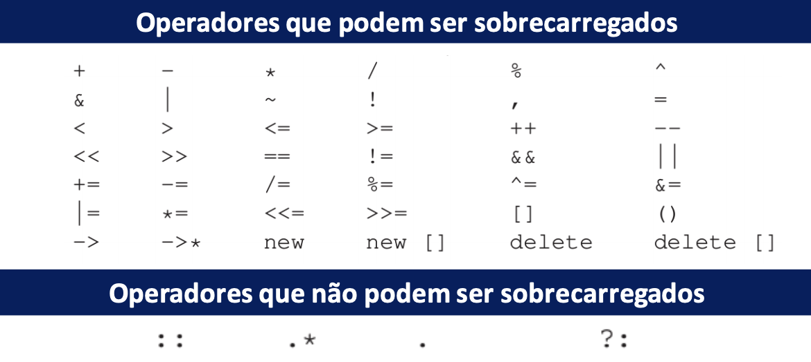
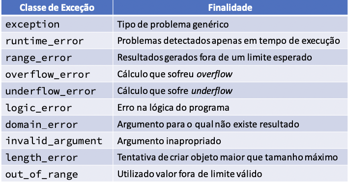
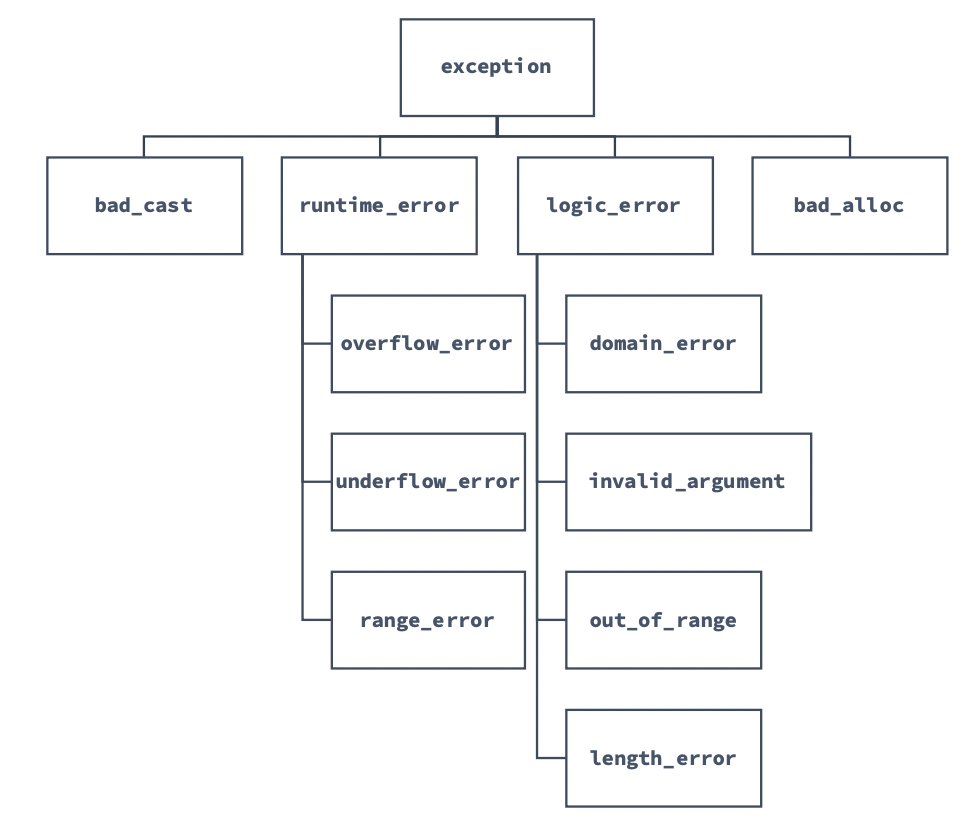

# INTRODUÇÃO A PROGRAMAÇÃO ORIENTADA A OBJETOS: 

## Surgimento: 

 - Crise do Software
   - Dificuldade de escrever programas eficientes e úteis;
   - Capacidade do hardware expandiu rapidamente;
   - Métodos existentes eram inadequados;


 - Principais Problemas
   - Reusabilidade e extensibilidade de módulos;
   - Representar entidades do mundo real;
   - Projetar sistemas com interfaces abertas;
   - Aumentar produtividade e diminuir custo;
   - Gerenciar tempo de entrega;

 - POO
   - Existe como coneito desde os anos 1950;
   - Primeira aparição em uma linguagem no final dos anos 1960 (Simula);
   - Popularização a partir dos anos 1990;
## Genealogia das Linguagens: 


## Hierarquia de Paradigmas: 


#### IMPERATIVO: 

 - Programas centrados no conceito de estado (variáveis) e ações (comandos)
 - Computação como um processo que realiza mudanças de estados
 - Especificam como um computador deve realizar uma tarefa;

#### DECLARATIVO: 

 - Descrevem relação explícita e precisa entre as entradas e saídas
 - Variáveis são incógnitas e não representam células de memória
 - Especificam o que são as tarefas (Ex: LISP,Prolog, SQL)

#### ESTRUTURADO: 

 - Também conhecido como estrutural
 - Separação clara entre dados e funções
 - Modelo centrado nas funções

Prós: 
  - Mais Eficiente
  - Útil para programas pequenos e algoritmos individuais

Contras: 
  - Não escalável
  - Inadequado para sistemas complexos/grandes

##
### Visão Geral sobre POO: 

- Ideías Chave:
  - Abstração de dados
    - Separação entre interface e implementação;
  - Herança
    - Modelagem de relacionamentos entre tipos similares
  - Vinculação Dinâmica
    - Uso de objetos similares, ignorando detalhes que os diferem

- Programas são estruturados em Módulos (classes) que agrupam um estado e operações
- Classes são usadas como tipos, cujas instâncias são objetos
- Programador usa abstrações mais próximas do mundo real
- Facilidade de reutilização do código
- Separação entre interface e implementação

##
### Abstração em POO: 

- Necessária para se concentrar apenas nos aspectos relevantes para o problema
- Define limites para o tamanho da classe
- Permite que a especificação possa ser gradativa
- Reduz complexidade de programação e utilização


##
### Objetos: 

- Objetos possuem estrutura (dados) e comportamento (funções)
- A estrutura de um objeto é representada em termos de atributos
- O comportamento de um objeto é representado pelo conjunto de operações que podem ser executadas a partir dele

#### Exemplos: 


##


##
### Classes: 

- Objetos com a mesma estrutura e o mesmo comportamento são agrupados em classes


- Classes descrevem um conjunto de objetos do mesmo tipo
- Cada objeto é dito ser uma instância de uma classe
- Cada instância de uma classe tem seus próprios valores para cada atributo
- Compartilham o mesmo comportamento com outras instâncias

##


##

### Atributos:

- Características específicas dos objetos
- Cada atributo tem um valor para um objeto particular
- Para cada atributo deve ser definido o nome do atributo e o tipo do valor que pode ser armazenado


##

### Metódos:

- Funções que podem ser aplicadas em/por um objeto de uma classe
- Conjunto de métodos forma o comportamento
- Objetos de mesma classe compartilham mesmos métodos
- Assim como funções, podem ter parâmetros

##

### Classes e Objetos em UML: 


##

### Mensagem: 

- Quando objeto A quer que o objeto B realize uma ação, uma mensagem de A para B é enviada
- Invocação é um método
- Deve conter:
  - O objeto alvo
  - O método a ser execudado
  - Parâmetros do método, se necessário


##

### Definição de Classes em C++


- Variáveis de instância:
  - Conjunto de identificadores que guardam os valores dos atributos em um determinado objeto

Exemplo:


- Métodos:
  - Declaração na forma de uma função
  - Parâmetros são passados quando o método é invocado


### Interface Pública VS Implementação

- A interface pública de um objeto contém os membros visíveis a outros objetos
  - Declarados com o modificador de acesso *public*
- A implementação de um objeto contém os membros privados do objeto
  - Vísiveis apenas dentro dos objetos onde eles foram declarados
  - Declarados com o modificador de acesso *private*
- A distinção entre interface pública e implementação é chamade de *encapsulamento*

### Encapsulamento

  - Separa os aspectos externos de um objeto dos detalhes internos de implementação do objeto
  - Evita que pequenas mudanças possam ter grandes efeitos colaterais
  - Permite que a implementação possa ser modificada sem afetar as aplicações que usam o objeto


Em geral, métodos de uma classe são dos seguintes tiposÇ
  - Seletores (get)
  - Modificadores (set)
  - Construtores 

### Construtores

  - Evocados quando se pretende criar uma nova instância da classe
  - Possuem declaração especial:
    - Mesmo nome da classe
    - Não fazem menção a valores de retorno
  - Podem exigir parâmetros, usados para inicialização
  - Classes Podem possuir mais de um construtor


### Seletores

  - Permitem obter os valores guardados nas variáveis de instância
  - Geralmente possuem argumento vazio e limitam-se a devolver o valor de um atributo
  - Habitualmente designados pela palavra get seguida pelo nome do atributo
  


### Modificadores 

  - Permitem alterar os valores das variáveis de instância
  - Geralmente têm como argumento o novo valor a atribuir
  - Não devolvem qualuer valor
  - Habitualmente designados pela palavra set seguido pelo nome do atributo


 

 ### Destruidores

  - Função membro de uma classe delete um objeto
  - Automaticamente invocados quando um objeto é destruido
    - Quando o escopo de utilização é encerrado
  - Não possui argumentos nem retorno, nem mesmo void
  - Definidos por padrão nas classes quando não declarados
  - Necessário quando a classe manipula dinamicamente a memória
  
  


 ### Herança
  - Permite criar novas classes a partir de classes existentes
  - A classe que herda (subclasse) reutiliza os atributos e métodos da classe herdada (superclasse)
  - A subclasse (classe derivada) pode adicionar novos atributos ou métodos, além de sobrescrever métodos da superclasse (classe base)
  


 ### FUNÇÃO AMIGA

 Definição: 

   - Função definida fora de uma classe, mas que possui acesso aos membros privados e protegidos dela 
   - Acessa a implementação como um membro da classe, sem o ser
   - Mesmo definida fora, deve ter seu protótipo declarado internamente á classe

Princpais utilidades:

  - Casos especiais onde membros privados da classe precisam ser acessados sem o uso de objetos desta;
  - Sobrecarga de operadores

Outros exemplos de uso: 

  - Definição de um operador/função que multiplica uma matriz por um vetor, onde ambos são classes diferentes;
  - Cada um possui sua respectiva representação e provê um conjunto de operações para manipular objetos do mesmo tipo
  - A rotina de multiplicação, se inserida como membro das classes, exigiria a implementação em ambas e acesso aos dados privados
    - Também exigiria a invocação a partir de objetos de uma das duas classes
  - O acesso a atributos de classes não é recomendado ser público
  - Solução: Declarar uma função de multiplicação como *amiga* de ambas

### SEPARANDO DEFINIÇÃO DE IMPLEMENTAÇÃO

A definição de classes em C++ é comumente divídida em dois arquivos separados (e ambos fora do arquivo de utilização destas):

  - A descrição da classe, com seus atributos e protótipos dos métodos costuma vir num arquivo .h 
  - A implementação dos métodos vem num arquivo .cpp com o nome da classes

Benefícios:

  - Se a implementação da classe não mudar, não precisa ser recompilada
  - Separação entre implementação e utilização explicita
  - Organização do código

### Uso do #ifndef

  - Algumas vezes podemos incluir um arquivo de cabeçalho múltiplas vezes
  - O compilador pode entender como se estivéssemos tentando redefinir alguma coisa novamente
  - Solução: Informar ao compilador (diretiva) que a biblioteca Num não deve ser redefinida se ja o foi


### SEPARANDO DE FATO

Compile cada arquivo .cpp num arquivo object (.o) que contém o código de máquina para aquele arquivo:
  - g++ -c main.cpp Num.cpp

Realize o link entre os arquivos e o executável:
  - g++ main.o Num.o

Se apenas o executável mudar, compile apenas ele:
  - g++ -c main.cpp 

Depois, linke-os novamente:
  - g++ main.o Num.o

### CRIANDO O ARQUIVO MAKE:

Arquivo que define as dependências do programa e o que precisa ser compilado
  - Processo automatizado por IDES

  - Quando invocado, compila apenas o que foi modificado 
  - Permite a limpeza dos arquivos de saída para recompilação

## NAMESPACES:

Poluição do espaço de nomes:

  - Programas grandes tendem a utilizar bibliotecas independentes
  - Bibliotecas independentes tendem a definir grande quantidade de nomes globais, classes, funções e etc.
  - Situação em que se torna comum a colisão entre nomes, devido á poluição do espaço de nomes;


Solução Ultrapassada:

  - Programadores evitavam tal poluição utilizando nomes muito grandes para entidades globais
  - Os nomes continham prefixo indicando qual biblioteca havia definido o nome:
  
```cpp
  class cplusplus_primer_Query { ... };
  string cplusplus_primer_make_plural(size_t, string&);
```

  - A definição de espaços de nomes provê um mecanismo muito mais controlável para a prevenção de colisões
  - Particiona o espaço de nomes global, criando um escopo
  - A definição de bibliotecas dentro de um espaço reservado permite que programadores possam definir nomes independentes do escopo global;
  

### NAMESPACE - DEFINIÇÃO:

  - Começa com a palavra chave *namespace* seguida da definição do nome
  - Na sequência, vem as declarações e definições delimitadas entre chaves;

```cpp
  namespace cplusplus_primer {
    class Sales_data { /* .... */};
    Sales_data operator+(const Sales_data&, const Sales_data&);
    class Query { /* ... */};
    class Query_base { /* ... */};
  } // like blocks, namespaces do not end with a semicolon;
```

### NAMESPACE - ESCOPO:

  - Cada novo namespace introduz um escopo diferente, podendo então ter membros com o mesmo nome;
  - Podem ser acessados diretamente por outros membros de outros espaços de nome;
  - Podem ser descontínuos

```cpp
  cplusplus_primer::Query q = cplusplus_primer::Query("hello");
  AddisonWesley::Query q = AddisonWesley::Query("hello");
```

#### Separação Interface/Implementação:

  - Atua junto da estratégia de separação de interface e implementação em arquivos separados


### NAMESPACE - DEFINIÇÃO DE MEMBROS:

  - Códigos internos a um espaço de nomes podem usar a forma curta dos nomes

```cpp
  namespace cplusplus_primer {
    //reopen cplusplus_prinmer
    //members defined inside the namespace may use unqualified names
    std::istrem&
    operator >> (std::istream& in, Sales_data& s) { /* ... */}
  }
```

  - Também é possível definir um membro de um ns fora dele:

```cpp
  // namespace members defined outside the namespace must use qualified names
  cplusplus_primer::Sales_data
  cplusplus_primer::operator+(const Sales_data&, lhs,
  const Sales_data& rhs) 
  {
    Sales_Data ret(lhs);
    // ...
  }
```

### NAMESPACE - Global e aninhamento:

  - Implicitamente declarado, pode ser referenciado pelo operador de escopo (sem nome) -> ::member_name
  - Podem ser aninhados:

```cpp
  namespace cplusplus_primer {
    //first nested namespace: defines the Query portion of the library
    namespace QueryLib {
      class Query { /* ... */};
      Query operator&(const Query&, const Query&);
      // ...
    }
    // second nested namespace: defines the Sales_data portion of the library
    namespace Bookstore {
      class Quote { /* ... */};
      class Disc_quote : public Quote { /* ... */};
      // . . . 
    }
  }

  cplusplus_primer::QueryLib::Query
```

### NAMESPACE - ALIASES:

  - Permite associar um sinônimo mais curto a um ns definido


```cpp
  namespace cplusplus_primer { /* ... */};

  namespace primer = cplusplus_primer;

  namespace Qlib = cplusplus_primer::QueryLib;
  Qlib::Query q;
```

### A DECLARAÇÃO USING:

  - Permite apresentar a utilização de um namespace por vez
  - Nomes introduzidos pela declaração obedecem regras normais de escopo:
    - São visíveis desde a declaração até o final do escopo onde a declaração aparece
    - Entidades com o mesmo nome definido em um escopo externo são escondidas
    - Nomes não qualificados podem ser usados somente dentro do escopo onde houve a declaração
    - Encerrando o escopo, nomes qualificados devem ser utilizados

```cpp
  #include <iostream>
  #include <string>

  using std::string;

  int main() {
    string str = 'Example';
    using std::cout;
    cout << str;
  }
```

### A DIRETIVA USING:

  - Diferente da declaração, permite usar a forma não qualificada de todos os nomes definidos em um namespace
  - Seu uso indiscriminado reintroduz os problemas de colisão inerentes a utilização de múltiplas bibliotecas

### A DIRETIVA USING - ESCOPO:

  - Torna o espaço de nomes disponível desde o escopo global do programa

```cpp
  // namespace A and function f are defined at global scope
  namespace A {
    int i, j;
  }
  
  void f() {
    using namespace A;

    // injects the names from A into the global scope

    cout << i * j << endl; //uses i and j from namespace A
    // ...
  }
```

### A DIRETIVA USING - PRECAUÇÕES:

  - Reintroduz riscos a colisão de nomes em programas grandes;
  - Torna programas vulneráveis a atualização de biblitoecas que venham a declarar nomes conflitantes;
  - Erros de longo prazo podem aparecer á medida que a biblitoeca for sendo mais explorada
  - Uso da declaração é mais indicado, pois oferece maior controle sobre erros;
  - Diretivas são mais úteis nos arquivos de implementação do próprio contexto do namespace;

## SOBRECARGA DE OPERADORES

### Definição:
Caso especial de polimorfismo onde diferentes operadores possuem
diferentes implementações dependendo de seus argumentos

```cpp
class GenericObject{
//...
}
int main(){
GenericObject A, B, C;
C = A + B; //ao invés de C = soma(A,B)
}
```

### Conceitos Básicos: 

Funções com nomes especiais
- Palavra-chave operator seguida do símbolo que se deseja sobrecarregar
- Exige tipo de retorno, lista de parâmetros e corpo

Possui o mesmo número de parâmetros do operador original
- Operador unário – um parâmetro
- Operador binário – dois parâmetros
  - Operando da esquerda deve ser o primeiro parâmetro

Quando são definidos como métodos, primeiro parâmetro recebe o
ponteiro this

Funções devem ou ser membros de classes ou possuir ao menos um
parâmetro de classe

```cpp
// erro: tentativa de redefinição do operador de soma para inteiros
int operator+(int, int);
```

Nem todos os operadores podem ser sobrecarregados

Somente operadores existentes podem ser sobrecarregados
  - Não é possível inventar novos operadores (p.ex operator**)

Alguns operadores são unários e binários (+, -, *, &)

Ordens de precedência são mantidas



### Chamada de Operador Sobrecarregado:
Pode ser chamado utilizando o operador como é comumente
utilizado ou como uma função tradicional

```cpp
// equivalent calls to a nonmember operator function
data1 + data2; // normal expression
operator+(data1, data2); // equivalent function call
```

O mesmo vale para sobrecarga como método de classe

```cpp
data1 += data2; // expression-based ‘‘call’’
data1.operator+=(data2); // equivalent call
```

### Operadores não recomendados

Operadores lógicos (&& e ||) sempre avaliam o operando da esquerda
antes do da direita

O operando da direita será avaliado sse o operando da esquerda não
determina o resultado

A sobrecarga destes operadores não preserva estas propriedades

### Operador de saída <<

Permite configurar uma saída padrão para objetos de uma classe:

```cpp 
ostream &operator<<(ostream &os, const Sales_data &item)
{
  os << item.isbn() << " " << item.units_sold << " "
  << item.revenue << " " << item.avg_price();
  return os;
}
```

### Operador de entrada >>

Define como se dá a entrada padrão para a classe que o sobrecarrega

```cpp 
istream &operator>>(istream &is, Sales_data &item)
{
  double price; // no need to initialize;
  is >> item.bookNo >> item.units_sold >> price;
  
  if (is) // check that the inputs succeeded
    item.revenue = item.units_sold * price;
  else
    item = Sales_data(); // input failed: default state

return is;
}
```

### Operadores aritméticos:

Normalmente são definidos como funções não-membros

```cpp 
// assumes that both objects refer to the same book
Sales_data
operator+(const Sales_data &lhs, const Sales_data &rhs)
{
  Sales_data sum = lhs; // copy data members from lhs into sum
  sum.units_sold += rhs.units_sold;
  sum.revenue += rhs.revenue;
return sum;
}
```

### Operadores de igualdade:

Normalmente, verifica se membros de objetos são idênticos

```cpp 
bool operator==(const Sales_data &lhs, const Sales_data &rhs)
{
  return lhs.isbn() == rhs.isbn() &&
  lhs.units_sold == rhs.units_sold &&
  lhs.revenue == rhs.revenue;
}

bool operator!=(const Sales_data &lhs, const Sales_data &rhs)
{
return !(lhs == rhs);
}
```

### Operadores relacionais:
Definidos quando existir definição lógica desta relação na classe

### Operadores de atribuição:
Uma classe pode definir operador de atribuição adicional para
flexibilizar os tipos de operandos permitidos do lado direito.

```cpp 
StrVec &StrVec::operator=(initializer_list<string> il)
{
  // alloc_n_copy allocates space and copies elements from the given range
  auto data = alloc_n_copy(il.begin(), il.end());
  free();
  // destroy the elements in this object and free the space
  elements = data.first; // update data members to point to the new space
  first_free = cap = data.second;
return *this;
}
```

### Operadores compostos:
Devem retornar uma referência para o operando da esquerda

```cpp 
Sales_data& Sales_data::operator+=(const Sales_data &rhs)
{
  units_sold += rhs.units_sold;
  revenue += rhs.revenue;
return *this;
}
```

### Operador de subscrição:

Classes que representam coleções de dados podem sobrescrever o
operador para recuperar por posição []

```cpp 
class StrVec {
public:
  std::string& operator[](std::size_t n)
  { return elements[n]; }
  const std::string& operator[](std::size_t n) const
  { return elements[n]; }

private:
  std::string *elements;
  // pointer to the first element in the array
};
```

## Templates

Uma “fórmula” para a criação de classes ou funções

Ex: Quando usamos um tipo genérico como vector ou uma função genérica
como find

- Suprimos a informação necessária para transformá-los numa classe ou função
específica

- Tal transformação de um modelo genérico para um objeto concreto se dá
durante a compilação

### Definindo um Template:

Problema: escrever uma função para comparar dois valores que
podem ser de diferentes tipos.

  - Possível solução: sobrescrita da função para diferentes tipos

```cpp
int compare(const string &v1, const string &v2)
{
  if (v1 < v2) return -1;
  if (v2 < v1) return 1;
  return 0;
}

int compare(const double &v1, const double &v2)
{
  if (v1 < v2) return -1;
  if (v2 < v1) return 1;
  return 0;
}
```

  - Solução mais adequada: definimos uma função template
    - Uma fórmula da qual podemos gerar versões com tipos específicos:

```cpp
template <typename T>
int compare(const T &v1, const T &v2)
{
  if (v1 < v2) return -1;
  if (v2 < v1) return 1;
  return 0;
}
```

### Instanciação do Template:

O compilador usa os argumentos da chamada para deduzir os
argumentos do template

```cpp
cout << compare(1, 0) << endl; // T is int
```

O compilador então “instancia” um template, substituindo T pelo tipo

```cpp
int compare(const string &v1, const string &v2)
{
  if (v1 < v2) return -1;
  if (v2 < v1) return 1;
  return 0;
}
```

### Parâmetros de tipo:

Os parâmetros de tipo também podem ser usados como tipo de
retorno...

```cpp
template <typename T> T foo(T* p)
{
  T tmp = *p; // tmp will have the type to which p points
  // . . .
  return tmp;
}
```

... e declarados mais de um (pode ser usado class para declaração)

```cpp
template <typename T, class U> calc (const T&, const U&);
```
### Parâmetros não-tipo:

Além de passarmos tipos como parâmetros, é possível passar
parâmetros que não representam tipos, mas valores const:

```cpp 
template<unsigned N, unsigned M>

int compare(const char (&p1)[N], const char (&p2)[M])
{
  return strcmp(p1, p2);
}

// Chamada:
compare("hi","mom");

// Instanciação:
int compare(const char (&p1)[3], const char (&p2)[4])

```

### Generalizando ainda mais:

A implementação de compare apresentou dois princípios na escrita
de código genérico:

- Parâmetros são referências para const
  - Evitam cópia e permitem qualquer tipo que não possa ser copiado


- Os testes na comparação utilizam somente o operador <
  - Evita tipos que não suportam variedades de operadores


Versão ainda mais genérica:

```cpp 
template <typename T> int compare(const T &v1, const T &v2)
{
  if (less<T>()(v1, v2)) return -1;
  if (less<T>()(v2, v1)) return 1;
  return 0;
}
```

### Templates de classes:

Permite que atributos de uma classe possam ter seus tipos definidos
posteriormente

```cpp 
template <class T>
class Exemplo
{
public:
  Exemplo();
  T& getProduto();
  void setProduto(const T &produto);
  void imprimeNomeObjeto();

private:
  T _produto;
  static int _indice;
  std::string _nome;
};
```

Usamos o parâmetro de tipo tanto em declarações como em retornos

```cpp 
template <class T>
Exemplo<T>::Exemplo()
{
  _indice++;
  _nome = "Objeto ";
  std::ostringstream ostr;
  ostr << _indice;
  _nome += ostr.str();
}
```

```cpp 
template <class T>
T& Exemplo<T>::getProduto()
{
  return _produto;
}
```

```cpp 
template <class T>
void Exemplo<T>::setProduto(const T &produto)
{
  _produto = produto;
}
```

```cpp 
template <class T>
void Exemplo<T>::imprimeNomeObjeto()
{
  std::cout << "Nome: " << _nome << std::endl;
}
```


### Template de classes - instanciação:

Cada instanciação de uma classe template constitui uma classe
independente;

Cada novo tipo não possui relacionamento com outros tipos
declarados, mas mesmos tipos serão derivados de mesma classe

```cpp 
Exemplo<int> teste1;
Exemplo<char*> teste2;
Exemplo<char*> teste3;

teste1.imprimeNomeObjeto(); // vai criar o objeto nº 1 do tipo int
teste2.imprimeNomeObjeto(); // vai criar o objeto nº 1 do tipo char*
teste3.imprimeNomeObjeto(); // vai criar o objeto nº 2 do tipo char*
```

## Tratamento e exceções

### Definição:

"Permite que partes desenvolvidas independentemente de um programa se comuniquem e tratem de problemas que surgem em tempo de execução"

  - Parte do programa pode detectar um problema e passar a tarefa de resolvê-lo para outra parte
  - A parte que detecta não precisa saber nada sobre a parte que trata e vice versa


### Vantagens no tratamento de exceções:

  - Separação de código
  - Rastreamento do erro
  - Recuperação de falhas
  - Prototipação

### Como Funciona ? 
O tratamento ocorre mediante a cooperação entre partes do programa para detecção e tratamento em diferentes blocos: 

  - throw: Bloco que compreende a parte que detecta o erro, lançando-o
  - try: Bloco que trata o erro lançado, começando com esta palavra e encerrando com a cláusula *catch*
  - Classes de exceção: Utilizadas para passar a informação sobre o que aconteceu entre uma excecão lançada e sua captura

#### A expressão throw:

Determina qual o tipo de exceção que será lançada, dependendo do possível erro envolvido

Ex sem tratamento: 

```cpp
Sales_item item1, item2;
cin >> item1 >> item2;
// check that item1 and item2 represent the same book
if (item1.isbn() == item2.isbn()) {
  cout << item1 + item2 << endl;
  return 0;
} else {
  cerr << "Data must refer to same ISBN"<< endl;
  return -1; // indicate failure
}
```

Exemplo com tratamento:

```cpp
// first check that the data are for the same item
if (item1.isbn() != item2.isbn())
  throw runtime_error("Data must refer to same ISBN");
  // if we’re still here, the ISBNs are the same
cout << item1 + item2 << endl;
```

#### O bloco try:

Define a lista de cláusulas catch para capturar exceções lançadas:

```cpp
try {
  program-statements
} catch (exception-declaration) {
  handler-statements
} catch (exception-declaration) {
  handler-statements
} // . . .
```

Exemplo completo : 

```cpp
while (cin >> item1 >> item2) {
  try {
    if (item1.isbn() != item2.isbn())
    throw runtime_error("Data must refer to same ISBN");
    cout << item1 + item2 << endl;
  } catch (runtime_error err) {
    // remind the user that the ISBNs must match and prompt for another
    cout << err.what() << "\nTry Again? Enter y or n" << endl;
    char c;
    cin >> c;
    if (!cin || c == ’n’)
    break;
    // break out of the while loop
    }
}
```

### O objeto exception:

- Um objeto é inicializado quando uma exceção é lançada e persite até que seja encontrando um catch
- Cuidados com o lançamento de ponteiros:
  - Passar ponteiros juntos do objeto pode gerar falha de memória quando alcancem o catch correspondente
- Se nenhum catch é encontrado, o programa é terminado.

### Exceções padrão:
C++ define várias classes para reportar problemas encontrados, distribuídas entre quantro bibliotecas:

  - exception: define exceções genéricas, comunicando uma falha mas sem prover informação adicional
  - stdexcept: define classes de exceção de propósito geral
  - new: define exceção do tipo bad_alloc
  - type_info: define exceção do tipo bad_cast

### Exceções da biblioteca stdexcept:

### Hierarquia de Classes
